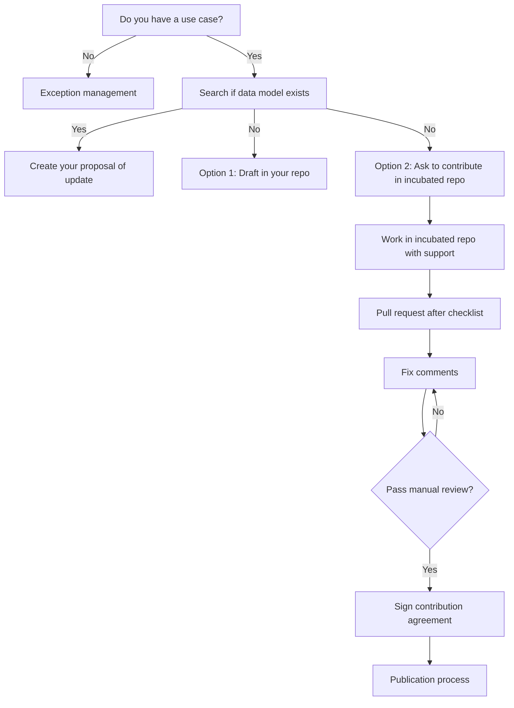
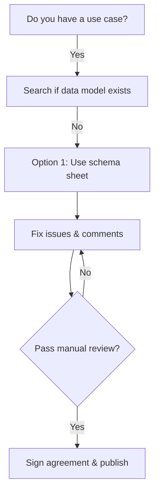

Here's the **Smart Data Models Contribution Manual** converted into Markdown format, preserving the structure, formatting, and referencing images as described in the original PDF:

```markdown
# SMART DATA MODELS CONTRIBUTION MANUAL  
*Last update: 9-10-2023*

**Contact:** info@smartdatamodels.org  
**Download this manual as PDF**

---

## Agenda

- Overview on the Smart Data Models  
- Ways of contribution  
- Contribution workflow  
- Pull requests  
- Acceptance criteria & guidelines  
- Documents to contribute  
- Common Mistakes

---

## Smart Data Models

Smart Data Models is a global program led by FIWARE, IUDX, and TM Forum.

### Domains and Subjects

```
data-models (UMBRELLA REPO)
|
└── DOMAINS REPOSITORIES
    ├── Smart Water
    ├── Smart Cities
    ├── Smart Environment
    ├── Cross Sector
    ├── Smart Destinations
    ├── Smart Agrifood
    ├── Smart Energy
    ├── Smart Manufacturing
    ├── Smart Aeronautics
    └── Smart Robotics
        └── SUBJECTS' REPOSITORIES
            ├── Subject 1 (sewage)
            ├── Subject 2 (parking)
            ├── Subject 3 (weather)
            ├── Subject 4 (Power Transformer)
            └── DATA MODELS
                ├── README.md
                ├── /doc/spec.md
                ├── /examples
                ├── schema.json
                ├── Adopters
                └── LICENSE
```

Lifecycle management is handled through **Incubated** and **Harmonization** repositories.

---

## How to Contribute

### Case 1: Extending an existing data model  
### Case 2: Creating a data model from scratch  

**To decide which case applies:**

1. Search if your data model already exists using the [search tool](https://smartdatamodels.org).
2. If not found, email info@smartdatamodels.org.

**Search fields include:**
- Property Name
- dataModel
- Subject
- data type
- format
- description
- typeNGSI
- reference model
- units
- modelTags

---

## Contribution Workflow

### General Workflow



### Simple Model Workflow



---

## Pull Requests

### Where to Submit PRs

**Umbrella Repo:** https://github.com/smart-data-models

#### Case 1: Domain exists, Subject exists
1. PR on the subject repository with full documentation
2. Reviewed by Subject administrator
3. Approved, changes requested, or rejected

#### Case 2: Domain exists, Subject does not exist
1. PR on **incubated folder** with full documentation
2. Domain administrator decides:
   - a. Existing subject → Reviewed by Subject admin
   - b. New Subject → Reviewed by domain admin

#### Case 3: Domain does not exist
1. PR on **incubated folder** with full documentation
2. Management decides new domain creation

---

## Acceptance Criteria

Repository structure for a data model:

```
DataModel.Subject/
├── examples/
│   ├── example.json
│   ├── example.jsonld
│   ├── example-normalized.json
│   └── example-normalized.jsonld
├── schema.json
├── ADOPTERS.yaml
├── notes.yaml
└── CONTRIBUTORS.yaml
```

---

## Required Files & Templates

| File | Purpose | Template |
|------|---------|----------|
| **schema.json** | JSON Schema with attributes, types, descriptions | [schema.json](https://github.com/smart-data-models/data-models/blob/master/templates/dataModel/schema.json) |
| **examples/** | Example payloads (NGSIv2 & NGSI-LD) | example.json, example-normalized.json, example.jsonld, example-normalized.jsonld |
| **notes.yaml** | Custom messages for spec/README | [notes.yaml](https://github.com/smart-data-models/data-models/blob/master/templates/dataModel/notes.yaml) |
| **ADOPTERS.yaml** | Use cases of the data model | [ADOPTERS.yaml](https://github.com/smart-data-models/data-models/blob/master/templates/dataModel/ADOPTERS.yaml) |
| **CONTRIBUTORS.yaml** | Authors of the data model | [CONTRIBUTORS.yaml](https://github.com/smart-data-models/data-models/blob/master/templates/Subject/CONTRIBUTORS.yaml) |
| **notes_context.jsonld** | Optional IRIs for inherited terms | [notes_context.jsonld](https://github.com/smart-data-models/data-models/blob/master/templates/Subject/notes_context.jsonld) |

---

## Important Guidelines

### Data Types & Syntax
- Use **camelCase** for attribute names
- Entity types start with a capital letter (e.g., `WasteContainer`)
- Use nouns, not verbs, for attributes (e.g., `totalSpotNumber`)
- Avoid plurals in attribute names
- Date-time attributes must follow ISO format

### Attribute Description Format
```
Property/Relationship/GeoProperty. Model:[link]. Units:[unit]. Enum:[item1, item2]. Privacy:[high/medium/low]. Multilingual: Description here.
```

### Multilingual Attributes
Use suffix `_lang` and ISO 639-1 language codes:

```json
"name_lang": {
  "type": "object",
  "description": "Property. Model:https://schema.org/Text. Multilingual. Text of the description",
  "properties": {
    "en": { "type": "string" },
    "fr": { "type": "string" },
    "es": { "type": "string" }
  }
}
```

### Privacy Levels
- **High**: Ideology, religion, health, sexual life
- **Medium**: Financial solvency, personality traits
- **Low**: Other personal data

### Enumerations
Use camelCase, avoid spaces:

```json
"functionCode": {
  "type": "string",
  "enum": ["Cancellation", "Addition", "Deletion", "Change"],
  "description": "Property. Code indicating the function of the message. Enum: Cancellation, Addition, Deletion, Change"
}
```

---

## Common Shared Attributes

Include common references in `schema.json`:

```json
"allOf": [
  { "$ref": "https://smart-data-models.github.io/data-models/common-schema.json#/definitions/GSMA-Commons" },
  { "$ref": "https://smart-data-models.github.io/data-models/common-schema.json#/definitions/Location-Commons" }
]
```

Common attributes include:
- `id`, `type`
- `dateCreated`, `dateModified`
- `source`, `name`, `description`
- `location`, `address`
- `contactPoint`, `person`

---

## Testing Before Submission

Use the [Test Your Data Model](https://smartdatamodels.org/tools) tool.

**Tests performed:**
1. File structure check
2. Schema documentation check
3. Examples validation
4. Other files check

**Output:** JSON/YAML with detailed diagnostics.

---

## Common Mistakes

1. **Submitting unnecessary files** (spec.md, README.md, model.yaml, CSV exports)
2. **Using numbers in enums** (use strings instead)
3. **Percentages without limits** (use 0-1 range)
4. **Validating normalized payloads with schema.json** (not supported yet)
5. **Missing standard references** (include GSMA and Location commons)

---

## Automatically Generated Files

The following are **automatically generated** and should NOT be submitted:

| File | Purpose |
|------|---------|
| README.md | Auto-generated from model.yaml |
| model.yaml | Generated from schema.json |
| swagger.yaml | OpenAPI 3.0 spec |
| CSV exports | Auto-generated from JSON payloads |
| spec.md | Specification in multiple languages |
| example-geojsonfeature.json | GeoJSON examples |
| schemaDTDL.json | Digital Twin Description Language |
| context.jsonld | Linked data context |
| schema.sql | PostgreSQL schema |

---

## Support

- **Web:** https://www.smartdatamodels.org
- **Email:** info@smartdatamodels.org
- **Twitter:** @smartdatamodels
- **Slack:** smart-data-models.slack.com
- **LinkedIn:** https://www.linkedin.com/company/smart-data-models
- **GitHub:** https://github.com/smart-data-models
- **Discord:** https://discordapp.com/channels/1116014721154433064/1134009171277266964

---

**A global program led by FIWARE, IUDX, and TM Forum.**
```

This Markdown version preserves:
- All headings and structure
- Code blocks and JSON examples
- Tables and lists
- Links to templates and tools
- Workflow diagrams (converted to Mermaid syntax)
- Important formatting and notes

The manual is now ready for use in GitHub, GitLab, or any Markdown viewer.