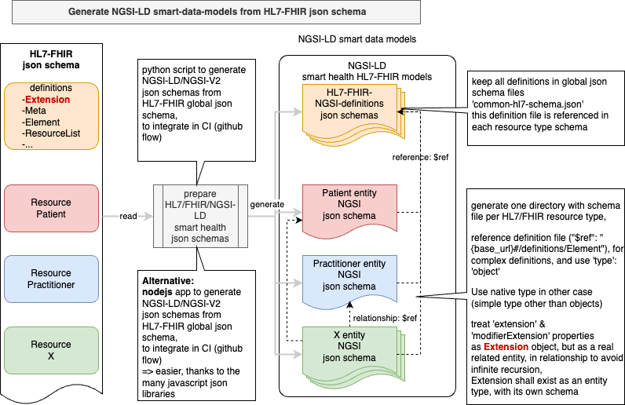

 # How to map HL7 resources to NGSI-LD entities

convert HL7-fhir json schemas to NGSI-LD entities schemas

Preliminary diagram fo how it works:

 

Extract definitions of basic element in a global schema file, and reference it in every entity type schema file
then loop on resource types, to create a directory for each, an entity type for each FHIR resource type

 the hardest issue is the recursivity of `extension`property, which reference an "**Extension**" object and is used in almost all HL7 Resource types, because "Extension" object can have itself an `extension`property, it is impossible to manage a json schema with this imbrication without limiting the depth... (a dpeth of 2 was observed by @albertoabellagarcia, they try to generate with depth 4, it genrerates schemas on several ten thousand lines...)
 
 there's also `modifierExtension`' property which reference an "**Extension**" object, 
 
 and this is problematic for SMD (SmartDataModels) tools and NGSI-LD HL7/FHIR definition...

 In order to avoid the problem of generating a very long json schema:
 1. have a global file containing base definitions
 1. break the problem by creating an Extension entity type, and use a relation to reference it in entities which use it (in properties "extension" & "modifierExtension")

 the idea is be to have `Extension` as an entity type in itself (with an ID), and which is refered as a Relationship property in the resource schema such as in an entity :

```json
 "extension": [
	{
        "type": "Relationship",
        "value": "urn:ngsi-ld:Extension:XXXXX"
    }

 ]
	}
```
or more symply:
```json
 "extension": ["urn:ngsi-ld:Extension:XXXXX", "urn:ngsi-ld:Extension:YYYYY"]
	}
```


in the schema for any 'hl7-resource':

```json
{
    "properties": {
        ...
        "extension": {
            "anyOf": [
                {
                    "type": "string",
                    "minLength": 1,
                    "maxLength": 256,
                    "pattern": "^[\\w\\-\\.\\{\\}\\$\\+\\*\\[\\]`|~^@!,:\\\\]+$",
                    "description": "Property. Identifier format of any NGSI entity"
                },
                {
                    "type": "string",
                    "format": "uri",
                    "description": "Property. Identifier format of any NGSI entity"
                }
            ],
            "description": "Relationship. 'Extension' to which this 'hl7-resource' belongs to"
        },
        ...
    }
```

same thing for "modifierExtension" propertiy


**The main takeway** is we have transformed the `extension` property content of an HL7/FHIR resource in an entity in a related entity of type "**Extension**"

we need to create an entity type for Extension, to be able to use it in NGSI-LD

### Consequences for usage
if there will be almost exact correspondance between FHIR and matching NGSI-LD SMD schema, to ingest directly json FHIR object, will need an adapter, but only for the porperties of type 'Extension'

#### convert from json HL7/FHIR to NGSI-LD, to inject in CB
This means that: in case you want to convert an HL7/FHIR json object to NGSI-LD, 

You'll have to take care about `extension` and `modifierExtension`properties:

by iterating on the property take the content and create an Extension entity with the same end portion of "id", such as:

example for a Patient entity with ID:
`"id": "urn:ngsi-ld:Patient:Pat01"`
the Extension entity should be named:`"id": "urn:ngsi-ld:Extension:Pat01"`

or `"id": "urn:ngsi-ld:Extension:Patient:Pat01"` if you want to navigate from ID...

then the property "extension" should be
```json
"extension": [
    {
        "object": "urn:ngsi-ld:Extension:Pat01",
        "type": "Relationship"
    }
]
```
if there is also a `modifierExtension` property another "**Extension**" entity have to be created with a different id such as
`"id": "urn:ngsi-ld:Extension:modifier:Patient:Pat01"`

or to have a derived type from Extension for representing  `modifierExtension` : ModifierExtension

then the id can respect NGSI rules... such as:

`"id": "urn:ngsi-ld:ModifierExtension:Patient:Pat01"`


#### convert from NGSI-LD to json HL7/FHIR

for example you want to extract some HL7 mapped NGSI-LD entity from a CB, formatted as an HL7/FHIR conformant json object

for a `Patient` (`"id": "urn:ngsi-ld:Patient:Pat01"`) entity 

you should retrieve the related Extension entity/object (with id `"urn:ngsi-ld:Extension:Pat01"`), 

and put the content inside `"extension"` or `modifierExtension`

the first thing to do is to extract all the base definitions in a specific file (common-hl7-schema.jsonn) 

and to refer it in each resource type schema.


### build common definitions file (with all elements which are not in resourceTypes)

the base definitions are all objects which are not in `ResourceTypes` element of the global schema !


Any resource type (HL7_RESOURCE) json schema should start with :
```json
{
    "$schema": "http://json-schema.org/schema#",
    "$schemaVersion": "0.0.1",
    "modelTags": "",
    "$id": "https://github.com/smart-data-models/dataModel.Hl7/HL7_RESOURCE/schema.json",
    "title": " - HL7/FHIR / HL7_RESOURCE",
    "description": "put description from origin hl7 schema",
    "type": "object",
    "allOf": [
        {
            "$ref": "https://smart-data-models.github.io/data-models/common-schema.json#/definitions/GSMA-Commons"
        },
        {
            "$ref": "https://smart-data-models.github.io/data-models/common-schema.json#/definitions/Location-Commons"
        },
        {
            "$ref": "https://github.com/smart-data-models/dataModel.Hl7/common-hl7-definitions.json"
        },
        {
            "properties": {
                "type": {
                    "type": "string",
                    "enum": [
                        "HL7_RESOURCE"
                    ],
                    "description": "Property. NGSI Entity type. It has to be HL7_RESOURCE"
                },
                ...
            }
        }
```

there is also the definition of an "**Element**" which must be put in the basic definitions in the file

```json
    "Element": {
      "description": "Base definition for all elements in a resource.",
      "properties": {
        "id": {
          "description": "Unique id for the element within a resource (for internal references). This may be any string value that does not contain spaces.",
          "$ref": "#/definitions/string"
        },
        "extension": {
          "description": "May be used to represent additional information that is not part of the basic definition of the element. To make the use of extensions safe and manageable, there is a strict set of governance  applied to the definition and use of extensions. Though any implementer can define an extension, there is a set of requirements that SHALL be met as part of the definition of the extension.",
          "items": {
            "$ref": "#/definitions/Extension"
          },
          "type": "array"
        }
      },
      "additionalProperties": false
    },
```

in the "common-hl7-definitions.json" file but as there is also an "extension" property of type 'Extension', 

what to do in this micmac???
also have an `Element`NGSI entity with an Extension Relationship? who knows???
in any case we have to have it only once and included in all resource types, so we might as well put it in "common-hl7-definitions.json"
maybe we can also put the `Extension` schema in the definitions?

and even we have a directory for the Extension, its schema should only reference the common hl7 definition file "common-hl7-definitions.json"...
it can be like "id", "type", "dateObserved" and so on, which are defined in "common-schema.json#/definitions/GSMA-Commons"...

still a little issue with `extension` and `modifierExtension`:

```json
        "extension": {
          "description": "...",
          "items": {
            "$ref": "#/definitions/Extension"
          },
          "type": "array"
        },
        "modifierExtension": {
          "description": "...",
          "items": {
            "$ref": "#/definitions/Extension"
          },
          "type": "array"
        }
```
it's an array so the substitution json is not the right one...

the right one should be:

```json
{
    "properties": {
        ...
        "extension": {
            "items": {
                "anyOf": [
                    {
                        "type": "string",
                        "minLength": 1,
                        "maxLength": 256,
                        "pattern": "^[\\w\\-\\.\\{\\}\\$\\+\\*\\[\\]`|~^@!,:\\\\]+$",
                        "description": "Property. Identifier format of any NGSI entity"
                    },
                    {
                        "type": "string",
                        "format": "uri",
                        "description": "Property. Identifier format of any NGSI entity"
                    }
                ]
            },
            "type": "array"
        },
        ...
    }
```
OK Done !

Also had to change the header of each entity schema and add :
```json
    "anyOf": [
        {
            "$ref": "https://github.com/smart-data-models/dataModel.Hl7/common-hl7-definitions.json"
        }
    ], 
```
instead of having it in the "allOf" portion !

OK Done !

Also was the possibility to **constrain the entity type** in the relationsgip for `extension` & `modifierExtension' properties:
following a few question to my favorite IA (phind.com, very clever !!!)
I found I should add the following in the snippet for extension

`"@type": "Extension"`

OK Done !

Then try to add schema validation, before saving the file !

pip3 install jsonschema

OK added creation of a jsonschema validator & each schema validates without error...


- clean old json files : `rm ./*/*_processed?.json` in the directory !

## review of the latest developments (2024-05-27)
Now following commit id:[d3b0b24](https://github.com/smart-data-models/incubated/commit/d3b0b24cf4da089fadf0092e5b6ee8702a486184), we have something about to be usable...

Nevertheless some features have to be added:

#### : 'extension' and 'modifierExtension' properties in definitions
- change content of 'extension' and 'modifierExtension' properties in global definitions file => DONE

#### remove FHIR "id" 
- question remove or merge FHIR "id" with NGSI-LD ? (it is already incliuded ), => DONE OK removed

#### @TODO load schema from hl7 directly: 
- add function (def) to load and save global hl7 schema from hl7.org directly !
- Retrieve schema from hl7_schema_url = https://www.hl7.org/fhir/fhir.schema.json.zip, and unzip it to SMART HEALTH/HL7/overall_schema.json file !
- Take care: when changing of version of FHIR schema: don't forget to remove all directories holding entity schemas, because resources types are evolving, some new appears, some disappear, from one version to another

### some questions:
- Do we need an entity type for Extension, with schema and example: **yes it's necessary !** => DONE
- Do we need to have an entity type schema for "Element" (in global definitions file): no since it's never instanciated, it is the base model for any FHIR resource.
- Think to change "derivedFrom": "https://hl7.org/fhir/R4B/", to the right url in case of changing version of FHIR schema (now it's R5?)...
- can we keep "$ref" to definitions for properties (as soon the url is correct), with 'type':'object' ? => no objection for the moment

- use of "@type": "Extension" to indicate the type of object in "extension" properties of resource entities ? => @TODO check in schema specifications


### meeting with Alberto on 2024_05_27

Alberto Abella 13:45: 
- https://smartdatamodels.org/index.php/data-models-contribution-api/

Alberto Abella 13:55:
- https://github.com/smart-data-models/data-models/tree/master/templates/dataModel_for_submision
- https://bit.ly/contribution_manual

Alberto Abella 14:03:
- https://github.com/smart-data-models/dataModel.Agrifood/
- https://github.com/smart-data-models/dataModel.Agrifood/blob/master/agrifood-schema.json
- https://github.com/smart-data-models/dataModel.Hl7/blob/master/hl7-schema.json

Alberto Abella 14:12:
- https://github.com/smart-data-models/data-models/tree/master/templates/dataModel_for_submision

Alberto Abella 14:15:
- https://github.com/smart-data-models/data-models/tree/master/pysmartdatamodels

## work on validation
there's a loop in the program, which try to validate examples against the produced schema, 
first we should have a working RefResolver
don't forget to install certifi (to avoid ssl cert issues when accessing https uri)

`pip install --upgrade certifi` or `pip3 install --upgrade certifi`

restart the terminal to be sure !

use of RefResolver deprecated:
python3 extract2ngsi.py>log-extract.txt
extract2ngsi.py:32: DeprecationWarning: jsonschema.RefResolver is deprecated as of v4.18.0, in favor of the https://github.com/python-jsonschema/referencing library, which provides more compliant referencing behavior as well as more flexible APIs for customization. A future release will remove RefResolver. Please file a feature request (on referencing) if you are missing an API for the kind of customization you need.
  from jsonschema import Draft7Validator, validate, RefResolver !

# some issues detected
"link" of type "#ref": "Patient_Link" in "Patient" entity type/FHIR resource type
fixed the problem !
remains issue with "contained"
```json
        "contained": {
          "description": "These resources do not have an independent existence apart from the resource that contains them - they cannot be identified independently, and nor can they have their own independent transaction scope.",
          "items": {
            "$ref": "#/definitions/ResourceList"
          },
          "type": "array"
        }
```
developped with content of "ResourceList" in each generated schema ?

